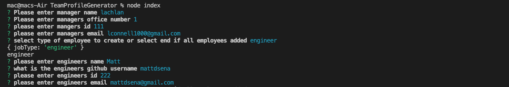
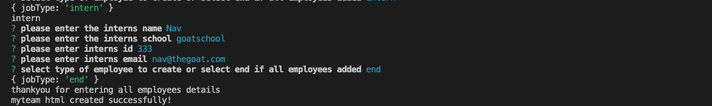
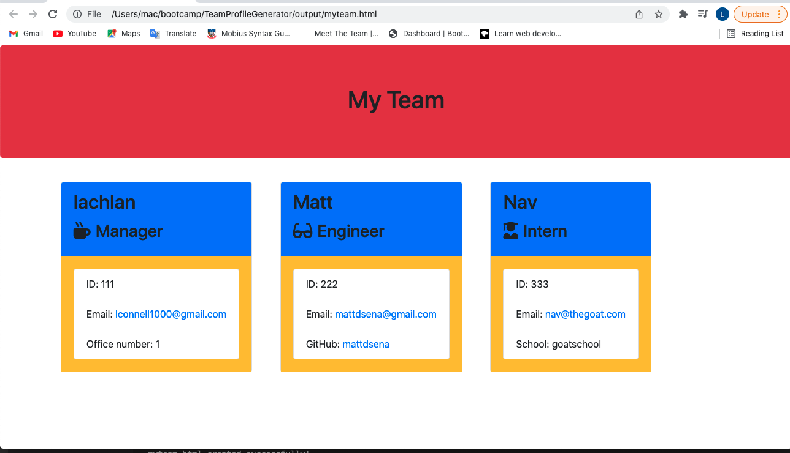

# 10 Object-Oriented Programming: Team Profile Generator

## The Project

For this project we had to make a node.js command-line application that take in information about employees on a software engineering team, and then this info is used to generate an HTML webpage which displays summaries for each project. This project as also to include unit tests for each part of our code and ensure that it passes each test. This amounted to 4 test Suits, with 3 tests in each which all passed!

When the user enters command-line application, then they are prompted for information about their team members and their team information. Then a HTML file is generated


## User Story

```md
AS A manager
I WANT to generate a webpage that displays my team's basic info
SO THAT I have quick access to their emails and GitHub profiles

```

## Acceptance Criteria

```md
GIVEN a command-line application that accepts user input
WHEN I am prompted for my team members and their information
THEN an HTML file is generated that displays a nicely formatted team roster based on user input
WHEN I click on an email address in the HTML
THEN my default email program opens and populates the TO field of the email with the address
WHEN I click on the GitHub username
THEN that GitHub profile opens in a new tab
WHEN I start the application
THEN I am prompted to enter the team manager’s name, employee ID, email address, and office number
WHEN I enter the team manager’s name, employee ID, email address, and office number
THEN I am presented with a menu with the option to add an engineer or an intern or to finish building my team
WHEN I select the engineer option
THEN I am prompted to enter the engineer’s name, ID, email, and GitHub username, and I am taken back to the menu
WHEN I select the intern option
THEN I am prompted to enter the intern’s name, ID, email, and school, and I am taken back to the menu
WHEN I decide to finish building my team
THEN I exit the application, and the HTML is generated
```

## Sone screenshots of the terminal line


The following images shows the terminal line prompts while in use:





## An image of the HTML page which is generated once executed

The following image shows what the web page looks like once it is generated from the prompts and answers shown above:



## A link to a video walk through of the demo

This link shows a video of the ReadMe Generator in action: https://drive.google.com/file/d/19Dylqekloj3YLcPEVy72itDfpZRG1U2s/view